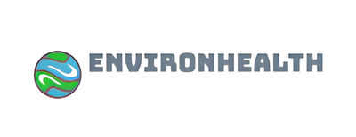

# EnvironHealth 🌍💨

  

### ¡La calidad del aire en tus manos!

**EnvironHealth** es un proyecto pionero que utiliza la tecnología de crowdsensing móvil para ofrecer a los ciudadanos información detallada y en tiempo real sobre la **calidad del aire** que respiran, con un enfoque especial en áreas con baja cobertura de estaciones de monitoreo. Con tu ayuda, ¡podemos mejorar la salud ambiental y mapear la contaminación en alta resolución! 

### Repositorios relacionados:

- [**Proyecto3A_Arduino**](https://github.com/Javitax47/Proyecto3A_Arduino)
- [**Proyecto3A_Android**](https://github.com/Javitax47/Proyecto3A_Android)
- [**Proyecto3A_Server_Backend**](https://github.com/Javitax47/Proyecto3A_Server_Backend)
- [**Proyecto3A_Server_Frontend**](https://github.com/Javitax47/Proyecto3A_Server_Frontend)

---

## 🚀 Objetivos del Proyecto

- **Monitoreo ambiental distribuido**: Recolección de datos sobre la calidad del aire a través de sensores móviles distribuidos.
- **Participación ciudadana**: Convertir a los ciudadanos en actores clave del proceso de recolección de datos.
- **Mapas de alta resolución**: Crear mapas detallados de contaminación con una precisión sin precedentes.
- **Validación científica**: Comparar los datos generados con estaciones de referencia para garantizar su utilidad.
- **Educación e información**: Informar a la población sobre los peligros de la contaminación y cómo les afecta.

---

## 🛠️ ¿Qué incluye el proyecto?

### 1. **Nodo Sensor Móvil**
- **💡 Sensores electroquímicos**: Sensores económicos y ligeros para medir contaminantes específicos (actualmente, **Ozono**).
- **🔌 Conectividad Bluetooth LE**: Transmisión eficiente de datos al smartphone del usuario.
- **🔋 Batería recargable**: Con conector mini USB para facilitar la recarga.

### 2. **Aplicación Móvil 📱**
- **📊 Datos en tiempo real**: Muestra niveles de contaminación y mapas interactivos.
- **📍 Geo-posicionamiento**: Las medidas se envían de forma automática al servidor, aportando datos valiosos y geoposicionados.
- **📸 Captura de imágenes**: Los usuarios pueden tomar fotos del horizonte urbano para ayudar a mapear zonas.

### 3. **Aplicación en Servidor 💻**
- **⚙️ Procesamiento de datos**: Aplicación de algoritmos para reducir la variabilidad y mejorar la precisión de los datos.
- **🗺️ Mapas de contaminación**: Generación de mapas detallados usando **Matlab** y **ArcGIS**, aplicando técnicas de interpolación geoestadística.
- **🔄 Comparación con estaciones de referencia**: Ajuste de los datos en tiempo real comparados con estaciones de monitoreo oficiales.

---

## 📡 Arquitectura del Sistema

### Comunicación entre componentes:
1. **Smartphone ↔️ Servidor**:
   - **Protocolo HTTP/REST**: Usamos el protocolo HTTP para comunicaciones simples y eficientes entre los sensores y el servidor.
   - **Protocolo MQTT (opcional)**: Para permitir la escalabilidad del sistema con un mayor número de nodos sensores, evaluamos el uso de MQTT.
   
2. **Formato de datos**: Utilizamos **JSON**, un estándar ampliamente compatible, para facilitar el intercambio de información entre dispositivos.

---

## 🛠️ Tecnologías utilizadas

- **Lenguajes**: Python, Java, Kotlin, Matlab
- **Frameworks**: Android SDK, iOS SDK
- **Sistemas de Procesado**: Matlab, ArcGIS
- **Protocolo de comunicación**: HTTP/REST, MQTT (opcional)
- **Formato de datos**: JSON
- **Hardware**: Sensores electroquímicos, Microcontroladores con Bluetooth LE, Smartphones

---

## 📊 ¿Cómo contribuir?

¡Cualquier persona interesada en la **monitorización ambiental** y el desarrollo de aplicaciones móviles puede colaborar! Hay muchas formas de participar en **EnvironHealth**:
- **Desarrollo de la aplicación móvil** (iOS/Android)
- **Optimización del procesamiento de datos** y la generación de mapas
- **Pruebas de campo** y validación de sensores
- **Difusión y educación**: Ayuda a concienciar a más personas sobre la importancia de la calidad del aire.

### 📝 Pasos para colaborar:
1. Haz un fork de este repositorio.
2. Crea una rama para tu funcionalidad (`git checkout -b feature/nueva-funcionalidad`).
3. Haz commit de tus cambios (`git commit -m 'Añadir nueva funcionalidad'`).
4. Haz push a la rama (`git push origin feature/nueva-funcionalidad`).
5. Abre un Pull Request 🚀.

---

## 📄 Licencia

Este proyecto está licenciado bajo la **Licencia MIT**. Consulta el archivo [LICENSE](LICENSE) para más detalles.

---

## 💡 Contacto

Para más información, sugerencias o preguntas, no dudes en contactarnos:
- **Email**: environhealth@upv.es
- **Desarrolladores principales**: [Javier Camarena Cuartero](https://www.upv.es/) (3º GTI, UPV)

¡Gracias por tu interés en **EnvironHealth**! Con tu ayuda, podemos hacer del aire que respiramos algo más limpio y saludable para todos. 💚🌱
